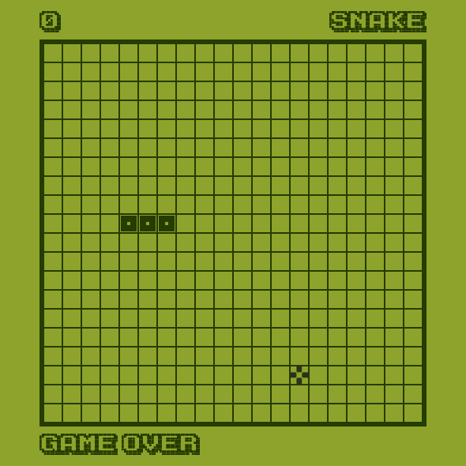

# Classic Snake Game

Reviving the Nokia's classic snake game using `pygame` . Navigate, devour, and grow your snake in this addictive classic game.

---

## Preview

|  |
| ---------------- |

---

## Requirements

- Python 3.11 or higher

- Git Bash (Optional)

---

## Installation

Open `cmd` or `bash` in the project directory.

**Install Python virtual environment**

```bash
pip install virtualenv
```

**Create a virtual environment**

```bash
virtualenv env_name
```

**Activate virtual environment**

On `Mac` and `Linux` (Also if you are using `bash` on `Windows`)

```bash
source env_name/bin/activate
```

On `Windows` (If you are using `cmd`)

```bash
.\env_name\Scripts\activate
```

**Install dependencies**

```bash
pip install -r requirements.txt
```

---

## Run Locally

```bash
python main.py
```

---

## License

[MIT](https://choosealicense.com/licenses/mit/)
